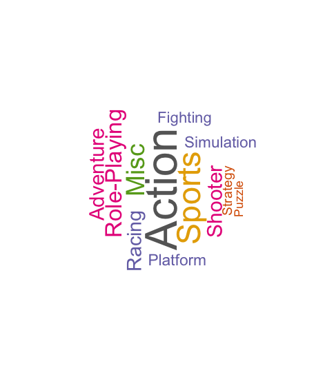
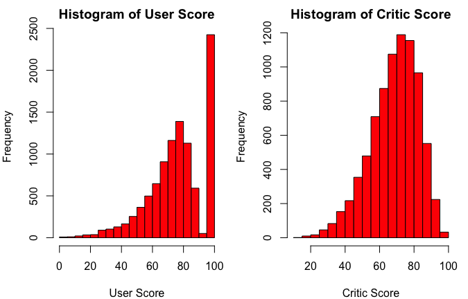
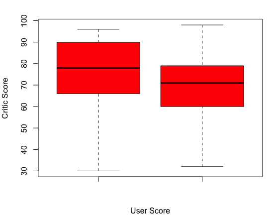

# VideoGame-Analysis

### Introduction 

   The Dataset that being used in this project is “Games” which is obtained from Kaggle in order to provide the insights of the analyse trend over the years in games genre and the sales. The data set consists of name, publisher, developer, platform, user, critic scores and other sales components details. It consists of 16717 records. This is a real time information based upon the Year of Release.
  
  The experiment is set up to perform the univariate and bivariate analysis. This analysis can be performed with Python or R Studio. In this project, R Studio is used with advanced features of libraries which enhance the data visualization. The packages used in the Project is as follows:
1. Ggplot2: Data visualization to plot charts
2. Readr: To read the dataset(csv file)
3. Tm: Representation for collection of documents
4. SnowballC: Collapse words to common root
5. Wordcloud: Visual representation of text data in cloud shape
6. RColorBrewer: Creation of Colour graphs

 ### Data Import
 
  The initial step will be loading the Games dataset into RStudio using the standard method such as “read.csv”, class, head, str and summary. The complete cases is identified by using “sum.complete(cases)”.
 
 ### Data Cleaning
 
 The next step is to do the process of Data Cleaning. Data cleaning involves with removing missing or null values. Replacing the irrational data, correcting the data types, coercion values change and removing duplicates if any. Here , the game genre were not in Init caps and it is changed to Initcaps by reassigning the same column name. The value in User Score is “ tbd ” which is unique and idle. This is changed to “NA”. The “NA” values present in the data set is removed by using na.omit 
 
 ### Exploratory & Descriptive Data Analysis
 
 The univariate analysis is done by the following methods:
 
1. Frequency: Rating, Genre
2. Mean: User Score, Critic Score, Global Sales,
3. Median: User Score, Critic Score, Global Sales,
4. Bar Chart: Global Sales, NA Sales, EU Sales, JP Sales.
5. Histogram: User Score, Critic Score
6. Pie Chart: Rating, Genre
7. Word Cloud: Genre

Bivariate Analysis is done comparing two variables with relevant data present in the dataset. Some of the bivariate analysis method is as follows:

1. Frequency: Rating, Genre
2. Percentage: Rating, Genre
3. Correlation: Relation of Global Sales with EA Sales, NA Sales and JP Sales
4. Covariance: Variation of Global Sales against EA Sales, NA Sales, and JP Sales
5. Bar Chart: Critic Count, User Count
6. Box Plot: User Score, Critic Score

### Results and Interpretation
The experiment is done by the above mentioned method and it was possible to analyse the genre of games sold out at high rate:
1. Pie Chart: Pie chart is created for the type of games under genre column and the rating commonly given for games. The result is as shown in belo figure:

2. Word Cloud : The text analysis is made with the genre of movies as univariate analysis approach. Finally, a word cloud is created for the maximum no of genre of games sold in “Big Text” and least will be “ Small text”. The output will be as shown in Figure:

3. Histogram is plotted between the columns User Score and Critic Score. The output is as shown in Figure:

4. Box Plot is plotted with the bivariate analysis method. This is plotted between User score and Critic Score. The output is as shown in Figure:

### Conclusion

The data analysis is made with video games by using descriptive, exploratory analysis. This gives a clear picture of most games with respect to genre rating and global sales in the market. This is done with various methods of univariate and bivariate analysis. This consists of pictorial, text visualizations of data present in the dataset. The comparison is done between the sales ,genres and the ratings attributes present in the dataset. The limitation of the analysis will be the understanding the real attributes of the dataset and applying the correct method to get the desired output as effective. The representation of the data can be predictive but not in all scenarios.

Finally, the outcome is resulted with the maximum no of genre game with ratings by using text analysis. Other Visualizations with the data is done with Histogram, Bar and Pie chart. The above analysis convey that the Action games has the highest no of Ratings among the people. The futuristic improvement is to predict by performing some higher order polynomial with some advanced method of regression. This could give a better rate of prediction with finding the best parameters by performing the analysis methods.

